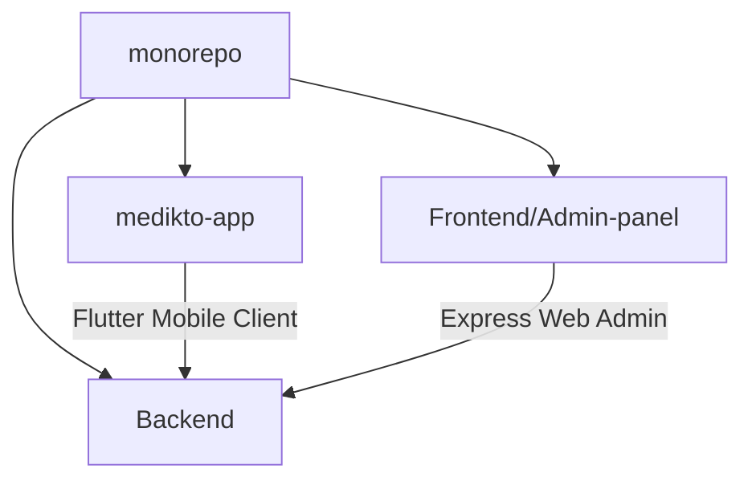

# Medikto - Medication Adherence & Health Tracking Ecosystem

Medikto is a complete healthcare monitoring monorepo designed to track patient medication compliance, log health vitals (Blood Pressure, Sugar, Temperature, Heart Rate), archive medical prescriptions/reports, and securely connect patients with hospital systems and caretakers.

---

## 🏗️ Monorepo Architecture

This workspace is structured as a monorepo containing three core components:

1. **`Backend/`:** Node.js Express REST API connected to MongoDB Atlas. Initializes database schemas, enforces role security policies, manages Twilio/Fast2SMS OTP integrations, Nodemailer invites, and FCM Firebase notifications.
2. **`medikto-app/`:** Flutter mobile application built for Patients (logging medications, vitals, uploading compliance selfies) and Caretakers (real-time read-only monitoring of parents/relatives).
3. **`Frontend/Admin-panel/`:** Administrative dashboard for Hospital Admins to manage linked patients, monitor adherence logs, and request access profiles.

---

## 👥 User Roles System

Medikto operates a role-based access control (RBAC) model across three segments:

* **`user` (Patient):** Can log and manage their own daily medications, upload adherence verification selfies, log health vitals, upload lab reports/prescriptions, and connect/disconnect hospital or caretaker linkages.
* **`guardian` (Caretaker):** Observer role (e.g. Son, Daughter). Can log into their own account, view all monitored patients' medication schedules, adherence compliance selfies, and vital records in **view-only/read-only mode**. Write/modifying API calls are securely blocked.
* **`admin` (Hospital Admin):** Admin role. Can search patients, request profiles linkage via secure OTP verification, and review active medication logs for patients associated with their hospital.

---

## 🗄️ Core Backend Models & Database Entities

* **`User`:** Represents patients, caretakers, and admins. Stores demographics, contact numbers, email, role type, active FCM token, connected hospitals list, and guardian-to-patient monitored mappings.
* **`Hospital`:** Managed entities linking hospital names, locations, and admin user IDs.
* **`HospitalLinkOTP`:** Temporary collection managing access code verification for hospital-to-patient connections.
* **`CaretakerInvite`:** Manages invitation pipelines linking patients with caretaker emails/phones.
* **`Medication` & `Dose`:** Stores medication name, timings (morning, evening, etc.), unit (ml, mg, gm), instructions, and individual doses tracking compliance status (Taken, Missed, Pending).

---

## 🔌 Core Third-Party Integrations

* **SMS Gateways (Twilio & Fast2SMS):** Handles OTP verification code dispatches on authentication and hospital linking requests.
* **Cloud Storage (Cloudinary):** Stores patient profile pictures, prescriptions, and dose compliance selfie uploads.
* **Email Dispatch (Nodemailer):** Dispatches email invitations to caretakers with registration walkthroughs.
* **Firebase Cloud Messaging (FCM):** Controls real-time push alerts sent to patients' devices when critical events occur (e.g., hospital association requests).

---

## 🏃 Quick Start Guides
* For mobile setup, build commands, and release compiles, see: 👉 **[MOBILE_SETUP.md](file:///d:/medikto/MOBILE_SETUP.md)**
* For a comprehensive list of modifications implemented inside this repository, see: 👉 **[CHANGELOG.md](file:///d:/medikto/CHANGELOG.md)**
